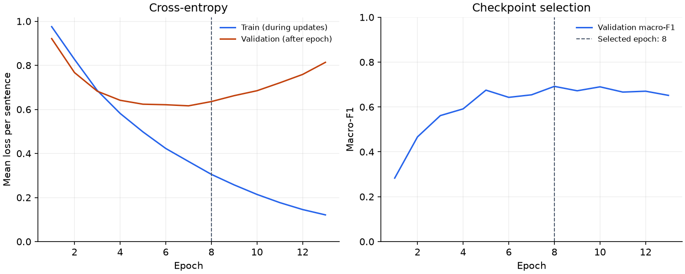

# Initial PyTorch reference

The first full `MeanPoolMLP` run reaches validation **macro-F1 0.6919** and **accuracy 0.7360**, selecting epoch **8** and stopping after epoch **13**. It establishes a reproducible neural reference before hyperparameter selection. The published test has not been evaluated.

## Configuration and protocol

The [original configuration](config.toml) uses learned 128-dimensional embeddings, masked mean pooling, and a 64-unit hidden layer with ReLU. The model has **388,227 parameters**, a 2,967-entry training vocabulary, and a maximum sequence length of 128 tokens. Dropout and weight decay are zero. AdamW uses learning rate `0.001` and batches of 32 sentences.

The run uses the frozen 2,074 training and 519 validation sentences, a vocabulary previously fitted only on train, and seed `17` on CPU with one computation thread and zero loader workers. Highest unrounded validation macro-F1 selects the checkpoint; ties keep the earliest epoch. The fixed limit is 30 epochs, with patience 5 and minimum improvement 0.0. No configuration was adjusted after inspecting this run.

This is one neural configuration, bringing the total to five of the initial ten TF-IDF/MLP configuration slots. The fresh-process reproduction uses the same settings and does not count as another configuration. Tiny memorization diagnostics are implementation checks, outside this selection budget.

## Validation results

| Model | Macro-F1 | Accuracy | Specific FLS recall |
| --- | ---: | ---: | ---: |
| Majority class | 0.2298 | 0.5260 | 0.0000 |
| Selected TF-IDF + logistic regression | 0.6924 | 0.7495 | 0.4651 |
| Initial mean-pooling MLP | 0.6919 | 0.7360 | 0.5814 |

The neural reference is 0.0005 below the selected TF-IDF model in macro-F1 and 0.0135 below it in accuracy on this partition. It recovers more specific FLS examples (50 versus 40 of 86), with lower precision for that class (0.5747 versus 0.7143). These validation scores do not establish a reliable advantage on unseen data; both checkpoint selection and the earlier TF-IDF comparison used this same partition.

| Class | Precision | Recall | F1 | Support |
| --- | ---: | ---: | ---: | ---: |
| `0: specific fls` | 0.5747 | 0.5814 | 0.5780 | 86 |
| `1: not-fls` | 0.8123 | 0.8242 | 0.8182 | 273 |
| `2: non-specific fls` | 0.6903 | 0.6687 | 0.6794 | 160 |

Confusion matrix (true classes in rows, predictions in columns):

| True / Predicted | Specific FLS | Not-FLS | Non-specific FLS |
| --- | ---: | ---: | ---: |
| Specific FLS | 50 | 16 | 20 |
| Not-FLS | 20 | 225 | 28 |
| Non-specific FLS | 17 | 36 | 107 |

The [metrics](metrics.val.json) come from the restored epoch-8 checkpoint's saved predictions, checked with the shared evaluator. [Summary values](summary.json) retain full precision. The recorded 1.93-second training interval includes epoch execution, checkpoint writes, and final restored-model validation; it is a local observation rather than a performance benchmark.

## Learning curves



Training loss continues to fall, while validation loss reaches its minimum at epoch 7 and then rises. This pattern indicates overfitting. Epoch 8 is retained because selection uses macro-F1 rather than loss. Five subsequent epochs fail to improve that score, triggering early stopping. The training curve records losses observed during parameter updates; validation loss is measured with fixed post-epoch weights.

## Reproduction and artifacts

From the repository root, after preparing the data and building the vocabulary:

```bash
DATASET_DIR=data/processed/39b6719f1d7197df4498fea9fce20d4ad782a083/split-v1
uv run --locked --extra data --extra train filing-sentence-classifier train \
  --data-dir "$DATASET_DIR" \
  --vocabulary-dir artifacts/preprocessing/vocabulary-v1 \
  --config configs/experiments/mean-pool-mlp-v1.toml \
  --output-dir artifacts/runs/mean-pool-mlp-v1 \
  --manifest-sha256 4ee27835475f8b5395e0b67bc29b3ae56faab36d365b8e1175f28f2a876b065a
```

Choose another output directory if that run already exists. Python 3.13.9, PyTorch 2.14.0, NumPy 2.5.3, and the remaining dependency versions and numerical settings are recorded in the [manifest](manifest.json).

A second fresh process imported the built wheel from an isolated extraction outside the checkout. It reproduced the full history, encoder, validation predictions, metrics, and plot byte for byte; checkpoint metadata and every CPU weight tensor also matched exactly. All recorded file hashes and sizes were verified. The [reproduction record](reproduction.json) identifies both runs, the wheel, compared artifacts, and the verification scope. Timestamps, durations, and run IDs differ by design; reproduction across other hosts or dependency versions was not tested.

The runs used uncommitted implementation changes. Their manifests explicitly mark `reproducible_from_commit: false`: the recorded base commit alone is insufficient. Each complete local run retains the actual imported Python sources, including new files, plus the project configuration, lockfile, Python version file, and working-tree diff. Those snapshots identify the code that produced these results.

This report contains aggregate copies of the original configuration, [epoch history](history.jsonl), metrics, summary, plot, and manifest. The manifest's full file inventory refers to `artifacts/runs/mean-pool-mlp-v1/`; its encoder, checkpoint, per-sample predictions, and source snapshot remain there outside Git. The reproduction run is preserved under `artifacts/runs/mean-pool-mlp-v1-reproduction/`. No train+validation refit or test evaluation was performed.
