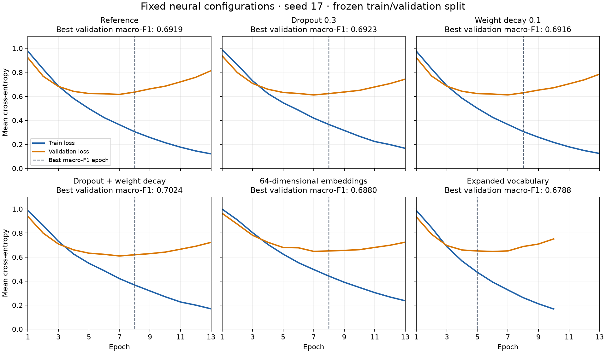
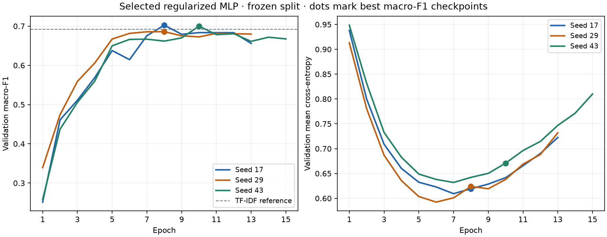

# MLP selection study

**Status: experimentation and model selection complete; delivery artifacts frozen.** Combined dropout and weight decay averages validation macro-F1 **0.6961 ± 0.0090** across seeds 17, 29, and 43. The frozen neural model is the predeclared seed-17 run, with macro-F1 **0.7024**; selected TF-IDF scores **0.6924**. All results use the same frozen development partition.

The immutable [registration](plan.json) predates the new runs. [Execution evidence](execution.json) records the commands, order, timestamps, exit codes, and manifest hashes. [Comparison data](comparison.json) contains unrounded scores, full per-class metrics and confusion matrices, numerical learning curves, preprocessing statistics, artifact identities, MLflow run IDs, and verification results.

The [selection record](selection.json) applies the rule to all six eligible candidates and identifies the chosen configuration, vocabulary, encoder, checkpoint, and MLflow run by their saved identities. Earlier evidence files remain unchanged, including their selection status at the time they were recorded.

## Configuration comparison (seed 17)

Each row uses predictions from its restored best macro-F1 checkpoint. Changes are relative to the original recipe, not cumulative changes to the preceding row. All neural runs use the same 2,074 training and 519 validation sentences.

| Candidate | Macro-F1 | Δ from reference | Accuracy | Best / completed epochs | Parameters | Training seconds |
| --- | ---: | ---: | ---: | ---: | ---: | ---: |
| [Reference](../../configs/experiments/mean-pool-mlp-v1.toml) | 0.691861 | — | 0.7360 | 8 / 13 | 388,227 | 2.186 |
| [Dropout 0.3](../../configs/experiments/mean-pool-mlp-dropout-v1.toml) | 0.692259 | +0.000398 | 0.7360 | 8 / 13 | 388,227 | 2.318 |
| [Weight decay 0.1](../../configs/experiments/mean-pool-mlp-weight-decay-v1.toml) | 0.691641 | −0.000220 | 0.7360 | 8 / 13 | 388,227 | 2.134 |
| [Dropout + weight decay](../../configs/experiments/mean-pool-mlp-regularized-v1.toml) | **0.702429** | **+0.010568** | **0.7437** | 8 / 13 | 388,227 | 2.138 |
| [64-dimensional embeddings](../../configs/experiments/mean-pool-mlp-small-v1.toml) | 0.688045 | −0.003816 | 0.7380 | 8 / 13 | 194,243 | 1.782 |
| [Expanded vocabulary](../../configs/experiments/mean-pool-mlp-vocab-min1-v1.toml) | 0.678778 | −0.013082 | 0.7360 | 5 / 10 | 720,515 | 2.123 |

Training durations include synchronous per-epoch MLflow logging. The reference time comes from its earlier tracked run on the same recorded environment; these single observations are not a controlled speed benchmark. Checkpoint sizes are 1,556,057 bytes for the reference and regularization variants, 780,121 for smaller embeddings, and 2,885,209 for expanded vocabulary.

## What changed

**Regularization:** the reference, dropout, decay, and combination form the registered 2 × 2 comparison. Dropout alone changes macro-F1 by only +0.0004; decay alone changes one prediction from one wrong class to another. Combining them improves macro-F1 by +0.0106 over the reference, +0.0102 over dropout, and +0.0108 over decay. It corrects seven reference errors and loses three previously correct predictions, leaving 133 errors instead of 137. The combination helps at these strengths and this seed; this does not establish a reliable interaction across runs.

**Capacity:** reducing embedding dimension from 128 to 64 roughly halves parameters, but lowers macro-F1 by 0.0038. Accuracy slightly increases because more correct non-specific-FLS predictions offset lower specific-FLS recall. Changing tensor dimensions also changes initialization and the optimization trajectory even with the same seed.

**Vocabulary:** retaining training singletons expands the vocabulary from 2,967 to 5,563 IDs, including PAD/UNK. Validation UNK occurrences after truncation fall from **1,047 to 690 of 17,324 tokens**, or **6.04% to 3.98%**. Nevertheless, macro-F1 falls by 0.0131 and specific-FLS recall drops to 0.4419. Coverage and model capacity change together, so this does not isolate the effect of rare-word coverage. The 690 remaining occurrences were unseen in train.

| Candidate | Specific FLS precision | Specific FLS recall | Specific FLS F1 | Not-FLS F1 | Non-specific FLS F1 | Not-FLS → specific FLS |
| --- | ---: | ---: | ---: | ---: | ---: | ---: |
| Reference | 0.5747 | 0.5814 | 0.5780 | 0.8182 | 0.6794 | 20 |
| Dropout | 0.5556 | 0.5814 | 0.5682 | 0.8170 | 0.6916 | 22 |
| Weight decay | 0.5747 | 0.5814 | 0.5780 | 0.8197 | 0.6772 | 20 |
| Combined regularization | 0.5930 | 0.5930 | 0.5930 | 0.8205 | 0.6938 | 19 |
| Smaller embeddings | 0.5402 | 0.5465 | 0.5434 | 0.8227 | 0.6981 | 19 |
| Expanded vocabulary | 0.6667 | 0.4419 | 0.5315 | 0.8287 | 0.6761 | 7 |
| Selected TF-IDF | 0.7143 | 0.4651 | 0.5634 | 0.8410 | 0.6727 | 2 |

Class supports are 86 specific FLS, 273 not-FLS, and 160 non-specific FLS. The final column counts only false specific-FLS predictions on true not-FLS sentences, not all specific-FLS false positives. Full confusion matrices and every class's precision and recall are in the comparison JSON.

Combined regularization exceeds TF-IDF's macro-F1 by **0.0101**, with higher specific-FLS recall (51/86 versus 40/86), but lower accuracy (**0.7437 versus 0.7495**) and many more not-FLS sentences predicted as specific FLS (19 versus 2). It has no established overall generalization advantage from this validation comparison alone.

## Learning curves and reviewed cases

All runs show training loss continuing to fall while validation loss eventually rises. Regularization moderates this divergence without removing it: at epoch 13, validation loss is **0.7226** for the combination versus **0.8137** for the reference. Their selected epoch-8 losses are **0.6193** and **0.6356**. Training loss includes dropout when enabled; validation is evaluated with dropout disabled. Dashed lines identify the best macro-F1 epoch, which need not minimize loss. Every run stops after five epochs without a strict macro-F1 improvement.

The comparison also revisits exactly the same 30 IDs from the [earlier error review](../validation-errors.md), keeping the published labels unchanged:

| Candidate | Reference errors corrected, all 519 rows | Reference correct predictions lost | Corrected among the 30 reviewed errors |
| --- | ---: | ---: | ---: |
| Dropout | 5 | 5 | 2 |
| Weight decay | 0 | 0 | 0 |
| Combined regularization | 7 | 3 | 2 |
| Smaller embeddings | 48 | 47 | 10 |
| Expanded vocabulary | 29 | 29 | 4 |

Dropout and combined regularization both correct **R11**, a completed inventory action with a future purpose, and **R27**, a standing accounting policy with prospective conditions. R27 remains flagged as context-sensitive in the earlier review; agreement with its label does not resolve that ambiguity. Neither run corrects any of the ten reviewed specific-FLS false negatives.

The smaller model fixes more of these reviewed errors while scoring lower on the complete partition. This illustrates why a sample chosen entirely from reference errors cannot measure net improvement: it omits the reference's correct predictions that a new model may lose. These previously exposed, direction-balanced cases remain qualitative development evidence.

## Execution and verification

The runs followed the declared order: **dropout → weight decay → combined → smaller embeddings → expanded vocabulary**, with no retries or failed attempts. They used the existing training CLI and local MLflow experiment `filing-sentence-classifier`. The plan's data, config, vocabulary, encoder, source, lockfile, and environment identities were verified before execution.

Fixed settings were seed **17**, CPU float32, one computation thread, zero workers, batch size 32, hidden dimension 64, learning rate `0.001`, at most 30 epochs, patience 5, and `min_delta=0.0`. Tokenization, prefix length 128, label mapping, and unweighted cross-entropy were unchanged. Only the expanded-vocabulary run used `artifacts/preprocessing/vocabulary-min1-v1/`; the others used `vocabulary-v1/`. Its training TOML intentionally matches the reference's effective settings, so its vocabulary and encoder hashes are essential to its identity.

The reference reuses `mean-pool-mlp-v1-tracked`, as registered. Its historical manifest retains the uncommitted-source status from that earlier run; the saved source bytes match the committed training code pinned in the plan. All five new runs used clean training source at execution commit `029c484b360df0a2f2383c43d1c77ea10fc25228`, with the same package hashes and environment.

Verification passed for all six neural runs: every manifest file hash and size, registered inputs and recipe, earliest best-score epoch, and early-stopping history. A separate process restored each encoder and checkpoint without fitting and reproduced its validation predictions, metrics, and loss exactly. The shared evaluator also recomputed saved-prediction metrics for all neural runs and the TF-IDF reference. All six MLflow runs are `FINISHED`, with matching parameters, epoch metrics, summaries, and byte-identical artifact mirrors.

Complete checkpoints, encoders, predictions, source snapshots, and histories remain under `artifacts/runs/<run_id>/` and in local MLflow, outside Git. The comparison JSON publishes aggregate evidence and their hashes; execution commands use paths relative to the repository root. Reproduction requires the frozen inputs and environment and a new output directory.

## Selected configuration

The registered rule maximizes **unrounded validation macro-F1** among the six eligible candidates. Exact ties prefer, in order: smaller embeddings, reference, weight decay, dropout, combined regularization, expanded vocabulary. Secondary diagnostics do not override that rule. Applying it selects [mean-pool-mlp-regularized-v1](../../configs/experiments/mean-pool-mlp-regularized-v1.toml) with **0.7024286921089247** macro-F1. There is no top-score tie; the margin over the runner-up, dropout alone, is **0.010170** (rounded for display).

The chosen recipe uses 128-dimensional embeddings, hidden dimension 64, dropout **0.3**, AdamW weight decay **0.1**, and the original train-only vocabulary (`min_frequency=2`, 2,967 IDs), with prefix length 128. Its existing seed-17 run supplies the **epoch-8 checkpoint** and matching encoder. Selection rechecked run inventories and registered identities and recomputed all six candidates' saved-prediction metrics; it required no new training. The selection JSON pins the evidence hashes and selected artifact paths and checksums, preserving the original configuration file.

## Variation across training seeds

The selected recipe was evaluated with the predeclared seeds **17, 29, and 43**. Seed 17 reuses its verified existing run; the two new runs change only `runtime.seed`. Data partitions, vocabulary, encoder, architecture, optimizer settings, early stopping, source code, and recorded environment remain identical. Each run contributes the validation metrics of its own restored best macro-F1 checkpoint.

| Seed | Macro-F1 | Accuracy | Specific-FLS recall | Best / completed epochs |
| --- | ---: | ---: | ---: | ---: |
| 17 (reused) | 0.7024 | 0.7437 | 0.5930 | 8 / 13 |
| 29 | 0.6858 | 0.7457 | 0.5116 | 8 / 13 |
| 43 | 0.7000 | 0.7399 | 0.6279 | 10 / 15 |
| Mean ± sample SD | **0.6961 ± 0.0090** | **0.7431 ± 0.0029** | **0.5775 ± 0.0597** | — |

The summary uses an arithmetic mean and **sample standard deviation (`ddof=1`, n=3)** over run-level metrics, without pooling predictions or creating an ensemble. Macro-F1 ranges from **0.6858 to 0.7024**. The recipe was selected using seed 17, which is included here; this is descriptive training-seed variation on one validation split, not an independent estimate of the whole selection procedure or uncertainty across data partitions.

Seed 29 has the highest accuracy but lowest macro-F1. It correctly classifies 243/273 not-FLS sentences, compared with 224 for seed 17, while detecting fewer specific FLS (44/86 versus 51/86) and non-specific FLS (100/160 versus 111/160). Specific-FLS F1 varies more than the other class F1 scores: its sample SD is **0.0299**, versus **0.0085** for not-FLS and **0.0057** for non-specific FLS.

The mean macro-F1 is **0.0037** above the fixed TF-IDF reference, but seed 29 falls below it and all three neural accuracies are lower. These three runs do not establish a reliable generalization advantage over TF-IDF. The selected configuration and predeclared delivery seed **17** are retained; the seed study does not select a replacement run.

Dots identify each run's best macro-F1 checkpoint. Seed 43 selects epoch 10 even though its validation loss is lower at an earlier epoch; the checkpoint criterion remains macro-F1. All runs stop after five epochs without a strict improvement.

The [seed execution record](seed-execution.json) preserves both commands, the config hashes fixed before execution, timing, and successful attempts. [Seed results](seeds.json) contain unrounded per-run and aggregate metrics, every class's precision/recall/F1, confusion matrices, numerical curves, artifact hashes, and MLflow identities. The original plan, comparison, selection, and seed-17 run remain unchanged.

Verification passed for all three runs: matching frozen identities and configuration except for the seed, complete artifact inventories, the best-epoch rule, and shared evaluation of saved predictions. A process separate from training restored every checkpoint and encoder and reproduced predictions, metrics, and validation loss exactly. MLflow reports all three runs as `FINISHED`, with matching parameters, metric histories, summaries, and byte-identical artifact mirrors. There were no failures or retries.

## Final artifact freeze

The [freeze record](freeze.json) closes this study and fixes **`mean-pool-mlp-regularized-v1`, seed 17, epoch 8** for subsequent evaluation and packaging. It identifies the checkpoint, encoder, training configuration, label mapping, input manifests, source commit, environment, and MLflow run. The existing **`tfidf-bigram-c10-v1`** pipeline remains the classical reference, with its fitted artifact and selection evidence pinned alongside the neural model.

The record links the original plan, execution, comparison, configuration selection, and seed study by SHA-256. Those earlier files retain their historical states. The weights and preprocessing artifacts remain in their original local run directories and MLflow; their paths, sizes, and hashes are recorded for downstream consumers. A later model change requires a new version with its rationale and prior data exposure recorded.

Final verification restored the frozen neural checkpoint in a separate process and exactly reproduced all 519 validation predictions, metrics, and loss. Its MLflow artifact mirror is byte-identical. The classical reference's inventory and both models' saved-prediction metrics were also verified. Closing the phase required no new training or train-plus-validation refit.

All **ten** initial configuration slots are accounted for: four TF-IDF and six MLP recipes; fixed-recipe seed repetitions add no tuning configurations. The observed seed variation and remaining class-level weaknesses are retained in the conclusions above. **Test remains reserved for final evaluation.**
