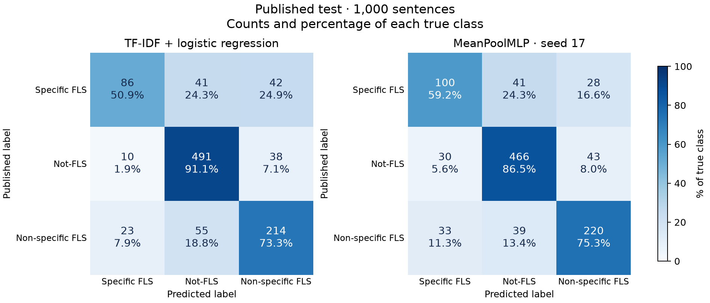

# Test results: quality, errors, and inference cost

The frozen models perform well above the majority reference, but the neural recipe does **not establish an advantage over TF-IDF**. Its predeclared delivery run (seed 17) has slightly higher macro-F1, while TF-IDF has higher accuracy and exceeds the neural mean across three seeds. Specific forward-looking statements remain the weakest class for both approaches.

This analysis uses the saved 1,000-row test campaign. It verifies artifact checksums and recomputes all five models' metrics from their saved predictions. No model is fitted, invoked, reselected, or changed. Numerical evidence, sampled IDs, and input hashes are in [analysis.json](analysis.json); individual seed scores and the evaluation protocol are in the [campaign report](README.md).

## Overall quality and seed variation

| Model | Validation macro-F1 | Test macro-F1 | Test accuracy |
| --- | ---: | ---: | ---: |
| Majority | 0.2298 | 0.2335 | 0.5390 |
| TF-IDF + logistic regression | 0.6924 | 0.7332 | 0.7910 |
| MeanPoolMLP, seed 17 | 0.7024 | 0.7387 | 0.7860 |
| MeanPoolMLP, three-seed mean ± sample SD | 0.6961 ± 0.0090 | 0.7253 ± 0.0121 | 0.7767 ± 0.0081 |

Seed 17's macro-F1 margin over TF-IDF is **0.0055** (0.55 percentage points), with five fewer correct predictions. The neural mean is **0.0079** below TF-IDF; seeds 29 and 43 obtain 0.7152 and 0.7221. All three neural runs predict the same class on 765 sentences, leaving 235 where their predictions differ. Similar aggregate scores can conceal different decisions on individual inputs.

The summary is the arithmetic mean and sample standard deviation (`ddof=1`) of the three separately evaluated runs. It is neither an ensemble result nor a metric computed by pooling 3,000 predictions. Configuration selection used seed 17 on validation; these runs repeat the fixed recipe, not the entire model-selection process. Three seeds describe training variability on this fixed split, not uncertainty from sampling a new test set or a confidence interval. No significance claim follows from comparing the difference with the seed SD. Seed 17 was declared for delivery before test and remains the delivery run; its being the strongest test seed does not change that decision.

Test scores are higher than validation scores for the selected models. These are unchanged models evaluated on different sentences; the increase is not a model improvement, proof that overfitting is absent, or evidence of generalization to new companies or years. The dataset provides no identifiers with which to evaluate those shifts. The majority baseline's 53.9% accuracy and 0.2335 macro-F1 also show why accuracy alone is insufficient for this imbalanced task.

## Per-class behavior

Each triplet below is **precision / recall / F1**. Supports are the published test labels, unchanged by this analysis. The neural average column reports class F1 across seeds, not the F1 of averaged precision and recall.

| Class (support) | TF-IDF | MLP, seed 17 | MLP class F1, mean ± SD |
| --- | --- | --- | --- |
| Specific FLS (169) | 0.7227 / 0.5089 / 0.5972 | 0.6135 / 0.5917 / 0.6024 | 0.5932 ± 0.0100 |
| Not-FLS (539) | 0.8365 / 0.9109 / 0.8721 | 0.8535 / 0.8646 / 0.8590 | 0.8546 ± 0.0072 |
| Non-specific FLS (292) | 0.7279 / 0.7329 / 0.7304 | 0.7560 / 0.7534 / 0.7547 | 0.7282 ± 0.0230 |



The MLP correctly identifies **100 of 169 specific-FLS sentences**, versus 86 for TF-IDF. The cost is lower precision: 63 of its 163 specific-FLS predictions are false positives, versus 33 of TF-IDF's 119. In particular, it labels 30 non-FLS sentences as specific FLS, compared with ten for TF-IDF.

For non-specific FLS, seed 17 improves both precision and recall over TF-IDF. That advantage does not hold consistently across seeds: mean class F1 is 0.7282, close to TF-IDF's 0.7304. TF-IDF has the strongest not-FLS F1, on the largest class. These tradeoffs explain how seed 17 obtains slightly higher macro-F1 while making more total errors.

## Shared and distinct errors

| Paired outcome: MLP seed 17 and TF-IDF | Sentences |
| --- | ---: |
| Both correct | 711 |
| Only MLP correct | 75 |
| Only TF-IDF correct | 80 |
| Both wrong | 134 |

The MLP makes 214 errors and TF-IDF makes 209. Among their shared errors, 109 have the same wrong prediction and 25 have different wrong predictions. The models' agreement is not independent confirmation of a label. Their differing successes do not, by themselves, establish that an ensemble would improve performance; none is fitted or evaluated here.

For the MLP, **153 errors cross the FLS/not-FLS boundary** and 61 confuse specific with non-specific FLS. TF-IDF has 144 and 65, respectively. Temporal meaning is therefore a substantial part of the problem, alongside the distinction between a company outlook and reusable cautionary language.

### Qualitative review

Before displaying text, the review fixed **two seed-17 MLP errors from each of the six true-to-predicted directions**, plus **three TF-IDF errors where the MLP is correct**. Each stratum is sorted by hexadecimal SHA-256 of UTF-8 `test-errors-v1|2026|<sample_id>`, taking the first entries. The 15 cases cover error directions and contrasting successes; they are not a representative prevalence sample. Selection does not use text, probabilities, length, or vocabulary coverage. This is a post-test diagnostic review, not a preregistered hypothesis test.

One assistant reviewed the cases against the [documented label meanings](../../data/README.md#labels). The observations below paraphrase their contents; full sentences remain in the local `artifacts/analysis/test-v1/review-sentences.json`. Source rows are zero-based positions in the published **test** split. Class IDs are **0 = specific FLS, 1 = not-FLS, 2 = non-specific FLS**. A dagger (†) flags an annotation/context question, not a verified labeling mistake.

| Case / source row | Gold | MLP 17 | TF-IDF | Observation |
| --- | ---: | ---: | ---: | --- |
| T01 / 725 | 0 | 1 | 0 | A dated company drilling-investment plan is missed by the MLP; TF-IDF recognizes the forecast. |
| T02 / 641 † | 0 | 1 | 1 | Possible political and regulatory exposures of named subsidiaries are missed by both. The boundary between a company risk and generic risk language needs context. |
| T03 / 767 | 0 | 2 | 0 | A forecast that company liquidity will cover future obligations is classified as generic by all three neural seeds, despite complete vocabulary coverage. |
| T04 / 687 † | 0 | 2 | 2 | Dated contractual redemption rights are labeled specific FLS. All models with text features choose generic FLS; rights versus anticipated actions need a clear annotation convention. |
| T05 / 550 | 1 | 0 | 2 | A completed accounting reclassification is mistaken for a forecast by both delivery models. Seeds 29 and 43 follow the historical label. |
| T06 / 238 | 1 | 0 | 1 | Confidence in the company's present positioning becomes a specific forecast for seed 17. TF-IDF and the other neural seeds classify it as non-FLS. |
| T07 / 773 | 1 | 2 | 2 | A counterfactual about an earlier valuation contains future-performance language. Both families classify it as generic FLS; all tokens are known. |
| T08 / 499 | 1 | 2 | 1 | A retrospective adjustment mentions expectations and a revised shutdown plan. Seed 17 misses the retrospective scope; TF-IDF and the other seeds retain it. |
| T09 / 277 † | 2 | 0 | 0 | A generic risk of never obtaining product approval is read as a company-specific forecast by all text models. The first-person subject does not settle specificity. |
| T10 / 85 | 2 | 0 | 2 | A named counterparty appears in a no-assurance disclaimer. Seed 17 predicts specificity; TF-IDF and the other seeds retain the generic risk label. |
| T11 / 671 | 2 | 1 | 2 | A possible rise in borrowing costs is missed by seed 17 despite zero unknown tokens. TF-IDF recognizes generic future risk. |
| T12 / 480 | 2 | 1 | 1 | A disclaimer that anticipated events might not occur is missed by every text model, with no unknown tokens or truncation. |
| T13 / 984 | 0 | 0 | 2 | Uncertainty about a named recipient's future company payments is classified as generic by TF-IDF; all neural seeds retain the company-specific label. |
| T14 / 764 | 0 | 0 | 1 | A sentence combines an existing rig count with a future addition. TF-IDF misses the future clause; neural seeds 17 and 43 recognize it. |
| T15 / 349 | 0 | 0 | 2 | A company funding-sufficiency forecast is classified as generic by TF-IDF; all neural seeds follow the specific label. |

The repeated themes are **temporal and clause scope** (T05, T07, T08, T14), **specificity versus boilerplate** (T03, T09, T10, T13, T15), and **missed explicit plans or risk statements** (T01, T11, T12). T02, T04, and T09 merit annotation/context review, but their published labels remain in every score. No rate of annotation error can be inferred from this selected sample.

Mean pooling discards token order in the [implemented neural model](../../src/filing_sentence_classifier/models/mean_pool_mlp.py); TF-IDF retains only local unigram/bigram features. That makes clause scope a plausible representation limitation. These observations do not identify the cause of any individual prediction, prove which words the classifier relied on, or show that an order-sensitive replacement would fix it.

### Vocabulary and truncation

These diagnostics cover the entire test split with the frozen neural encoder, rather than only the reviewed cases. UNK rates are unknown occurrences divided by retained token occurrences.

| Seed-17 outcome | Sentences | Median original tokens | Retained UNK rate | Truncated |
| --- | ---: | ---: | ---: | ---: |
| Correct | 786 | 29.0 | 6.12% | 3 |
| Incorrect | 214 | 29.5 | 6.30% | 0 |

**55 of the 214 MLP errors contain no unknown tokens**, and all three truncated sentences are correct for seed 17. Neither diagnostic explains the observed errors on its own. The similar aggregate UNK rates are descriptive and confounded by class and sentence content; they do not prove that missing words are harmless or that expanding the vocabulary would help. No vocabulary, length limit, or cleaning rule is changed after this review.

## Quality alongside inference cost

The following measurements are reused from the [existing benchmark](../inference-v1/README.md), whose bundle hashes match the evaluated seed-17 and TF-IDF artifacts. They use **519 validation texts**, one CPU computation thread on an Apple M3 Max, three fresh-process trials, and warmed repeated API calls. They are not new test-set timings.

| Measurement | TF-IDF | MLP, seed 17 |
| --- | ---: | ---: |
| Bundle size, including manifest | 303,884 bytes (0.290 MiB) | 1,637,623 bytes (1.562 MiB) |
| Fresh-process load, median | 723.482 ms | 741.165 ms |
| Single-sentence warm request, median / p95 | 0.916 / 0.960 ms | 0.082 / 0.115 ms |
| Batch 32 throughput | 17,637 sentences/s | 25,578 sentences/s |
| Batch 128 throughput | 28,199 sentences/s | 24,511 sentences/s |

The neural implementation is faster for single sentences and batch 32 on this workload. TF-IDF has a smaller bundle and higher batch-128 throughput, while also achieving higher test accuracy and exceeding the neural mean macro-F1. This supports a workload-dependent tradeoff, not a universal quality or speed winner. The delivery selection is preserved rather than changed in response to test results.

The bundle sizes exclude dependencies and do not measure process RAM. Load timing includes runtime imports and integrity checks, excludes interpreter startup, and does not clear OS caches. Warm timing covers the whole prediction API, including preprocessing and the TF-IDF backend's per-call thread-limit context; it excludes JSON, file/network I/O, and service concurrency. These measurements do not establish production latency, cross-hardware performance, or the cause of a runtime difference.

## Limits and subsequent use

The result is a reproducible comparison on the pinned FLS split, with the documented sampling and annotation limits. It does not establish generalization to unseen companies, years, or the natural distribution of all filing sentences. Exact normalized overlap was controlled; semantic overlap could remain. Test scores also include the explicitly declared `U+0099 → ™` evaluation adapter; direct bundle input still follows the original cleaning contract. Probabilities are uncalibrated.

Context-aware labeling review and representations that preserve clause structure are reasonable future hypotheses. They are not additional experiments in this campaign. Once these test errors inform new development, an independent held-out evaluation is needed for a new final generalization claim. The models, seed-17 delivery choice, predictions, metrics, and benchmarks used here stay frozen.

## Reproduce the analysis

```bash
uv run --locked --extra data --extra train python reports/test-v1/analyze.py
```

The script requires the existing local campaign artifacts and frozen encoder. It checks hashes and metric equality, aggregates seed results, chooses review IDs, computes diagnostics, and renders the confusion matrices. It writes derived `analysis.json` and `confusion-matrices.png` in this directory and keeps sampled source sentences under ignored `artifacts/analysis/test-v1/`. Use `--output-dir PATH` to reproduce derived outputs separately. It never runs inference, retrains models, or rewrites the evaluation evidence. The qualitative observations above are review judgments rather than generated labels.

Verification reproduced the JSON and PNG byte-for-byte in a separate output directory. An independent NumPy calculation matched all aggregate means and sample standard deviations; paired totals, sample strata, input hashes, and Ruff lint/format checks also passed. The figure was visually checked for legible labels and counts.
